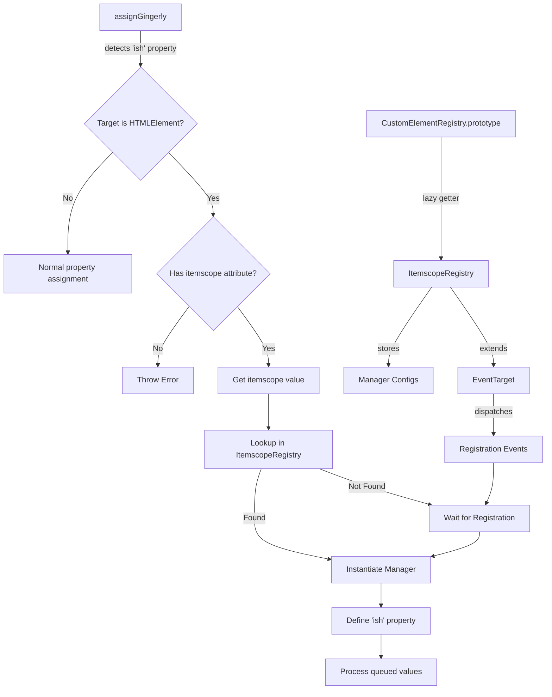
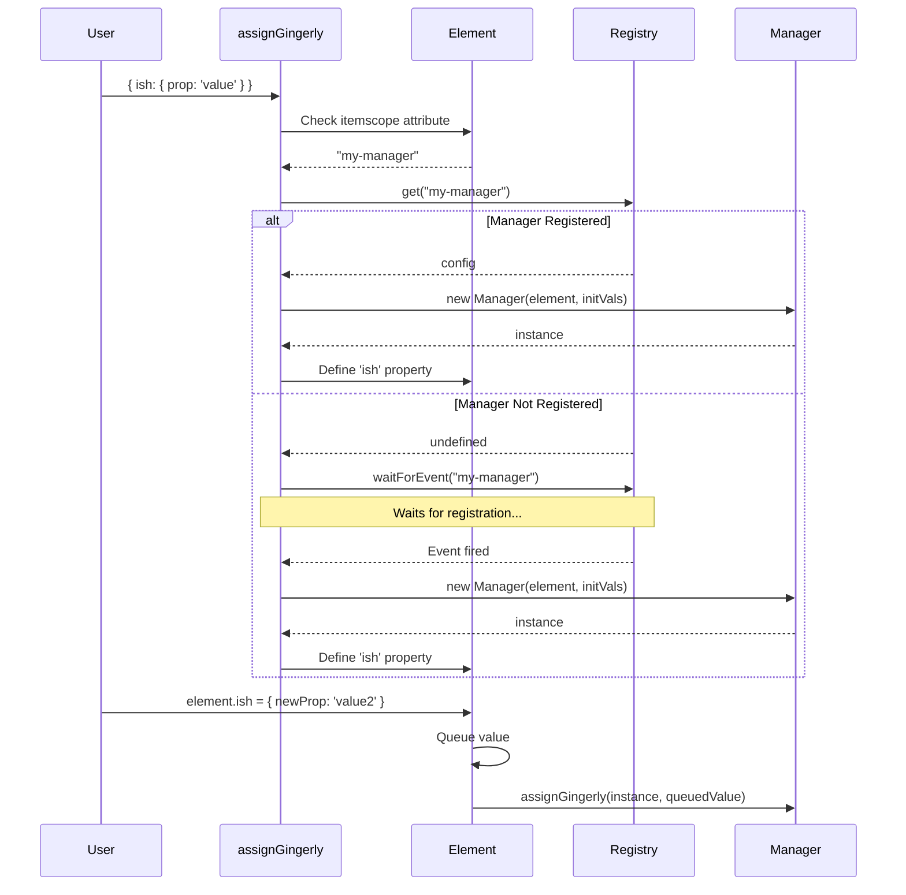

# Design Document: ItemScope Managers

## Overview

This design extends the assign-gingerly library to support ItemScope Managers - classes that manage DOM fragments and their associated data/view models for elements with the itemscope attribute. The implementation follows the existing EnhancementRegistry pattern, adding a parallel ItemscopeRegistry system and extending assignGingerly to handle the 'ish' (itemscope host) property.

### Key Concepts

- **ItemscopeRegistry**: A registry class extending EventTarget that stores manager configurations, parallel to EnhancementRegistry
- **Manager Configuration**: Lightweight configuration objects containing manager class constructors and optional lifecycle keys
- **ISH Property**: The 'ish' property on HTMLElements that triggers manager instantiation and provides access to manager instances
- **Lazy Registration**: Support for assigning 'ish' properties before manager classes are registered, using event-based waiting
- **Dual Behavior**: The 'ish' property has special behavior only for HTMLElements with itemscope attributes; for other objects it's a normal property

### Design Goals

1. Maintain consistency with existing EnhancementRegistry patterns
2. Support lazy registration for progressive enhancement scenarios
3. Provide clear error messages for misconfiguration
4. Enable seamless integration with existing assignGingerly features
5. Minimize performance overhead through caching and lazy initialization

## Architecture

### High-Level Architecture



### Component Relationships

1. **ItemscopeRegistry** extends EventTarget and manages manager configurations
2. **CustomElementRegistry.prototype.itemscopeRegistry** provides access to the registry
3. **assignGingerly** detects 'ish' properties and orchestrates manager instantiation
4. **Manager instances** are cached per element and accessed via the 'ish' property
5. **waitForEvent** enables lazy registration by listening for manager definition events

### Integration Points

- **object-extension.ts**: Defines CustomElementRegistry.prototype.itemscopeRegistry
- **assignGingerly.ts**: Core logic for detecting 'ish' properties and loading handler on demand
- **handleIshProperty.ts**: ISH property handler functions (loaded on demand)
- **types/assign-gingerly/types.d.ts**: Type definitions for ItemscopeRegistry and manager configurations

## Components and Interfaces

### ItemscopeRegistry Class

**Location**: `assignGingerly.ts`

```typescript
export class ItemscopeRegistry extends EventTarget {
  #configs: Map<string, ItemscopeManagerConfig> = new Map();

  /**
   * Define a new manager configuration
   * @param name - Manager name (matches itemscope attribute value)
   * @param config - Manager configuration object
   * @throws Error if name is already registered
   */
  define(name: string, config: ItemscopeManagerConfig): void {
    if (this.#configs.has(name)) {
      throw new Error('Already registered');
    }
    this.#configs.set(name, config);
    this.dispatchEvent(new Event(name));
  }

  /**
   * Get a manager configuration by name
   * @param name - Manager name
   * @returns Manager configuration or undefined
   */
  get(name: string): ItemscopeManagerConfig | undefined {
    return this.#configs.get(name);
  }
}
```

**Key Design Decisions**:
- Extends EventTarget to support lazy registration via events
- Uses private Map for configuration storage
- Throws on duplicate registration to prevent silent bugs
- Dispatches events with manager name as event type for targeted listening

### Manager Configuration Types

**Location**: `types/assign-gingerly/types.d.ts`

```typescript
/**
 * Constructor signature for ItemScope Manager classes
 */
export type ItemscopeManager<T = any> = {
  new (element: HTMLElement, initVals?: Partial<T>): T;
}

/**
 * Configuration for ItemScope Manager registration
 */
export interface ItemscopeManagerConfig<T = any> {
  /**
   * Manager class constructor
   */
  manager: ItemscopeManager<T>;
  
  /**
   * Optional lifecycle method keys
   * - dispose: Method name to call when manager is disposed
   * - resolved: Property/event name indicating manager is ready
   */
  lifecycleKeys?: {
    dispose?: string | symbol;
    resolved?: string | symbol;
  };
}
```

**Key Design Decisions**:
- Minimal required properties (only manager constructor is required)
- Lifecycle keys are optional and support both string and symbol keys
- Constructor signature matches Element enhancement pattern (element first, initVals second)
- Generic type parameter allows type-safe manager definitions

### CustomElementRegistry Extension

**Location**: `object-extension.ts`

```typescript
declare global {
  interface CustomElementRegistry {
    enhancementRegistry: typeof EnhancementRegistry | EnhancementRegistry;
    itemscopeRegistry: ItemscopeRegistry;
  }
}

if (typeof CustomElementRegistry !== 'undefined') {
  Object.defineProperty(CustomElementRegistry.prototype, 'itemscopeRegistry', {
    get: function () {
      const registry = new ItemscopeRegistry();
      Object.defineProperty(this, 'itemscopeRegistry', {
        value: registry,
        writable: true,
        enumerable: false,
        configurable: true,
      });
      return registry;
    },
    enumerable: false,
    configurable: true,
  });
}
```

**Key Design Decisions**:
- Lazy getter pattern matches enhancementRegistry implementation
- Self-replacing getter ensures single registry instance per CustomElementRegistry
- Non-enumerable to avoid polluting CustomElementRegistry enumeration
- Configurable to allow testing and advanced use cases

### ISH Property Detection and Processing

**Location**: `assignGingerly.ts` (modifications to main function)

The 'ish' property detection occurs in the first pass of assignGingerly, before nested path processing:

```typescript
export function assignGingerly(
  target: any,
  source: Record<string | symbol, any>,
  options?: IAssignGingerlyOptions
): any {
  // ... existing validation ...

  // Process 'ish' property for HTMLElements with itemscope
  if ('ish' in processedSource) {
    if (typeof HTMLElement !== 'undefined' && target instanceof HTMLElement) {
      // Load handler on demand to keep assignGingerly.ts size minimal
      const { handleIshProperty } = await import('./handleIshProperty.js');
      await handleIshProperty(target, processedSource['ish'], options, assignGingerly);
      // Remove 'ish' from processedSource to prevent normal assignment
      delete processedSource['ish'];
    }
    // For non-HTMLElement targets, 'ish' is processed as a normal property
  }

  // ... existing processing logic ...
}
```

**Key Design Decisions**:
- Check for HTMLElement type before special processing
- Non-HTMLElement objects treat 'ish' as a normal property
- Remove 'ish' from processedSource after handling to prevent double-processing
- Async handling to support lazy registration with waitForEvent
- Dynamic import of handleIshProperty module keeps assignGingerly.ts size minimal
- Pass assignGingerly function reference to avoid circular dependencies

### ISH Property Handler

**Location**: `handleIshProperty.ts` (new file, loaded on demand)

```typescript
export async function handleIshProperty(
  element: HTMLElement,
  value: any,
  options: IAssignGingerlyOptions | undefined,
  assignGingerlyFn: (target: any, source: any, options?: IAssignGingerlyOptions) => any
): Promise<void> {
  // Validate itemscope attribute
  const itemscopeValue = element.getAttribute('itemscope');
  if (typeof itemscopeValue !== 'string' || itemscopeValue.length === 0) {
    throw new Error('Element must have itemscope attribute set to a non-empty string value');
  }

  // Validate value is an object
  if (typeof value !== 'object' || value === null) {
    throw new Error('ish property value must be an object');
  }

  // Get or create the 'ish' property on the element
  if (!('ish' in element)) {
    await defineIshProperty(element, itemscopeValue, options, assignGingerlyFn);
  }

  // Queue the value for assignment
  const ishDescriptor = Object.getOwnPropertyDescriptor(element, 'ish');
  if (ishDescriptor && ishDescriptor.set) {
    ishDescriptor.set.call(element, value);
  }
}
```

**Key Design Decisions**:
- Exported function in separate file for on-demand loading
- Accepts assignGingerlyFn parameter to avoid circular dependencies
- Validates itemscope attribute before processing
- Validates value is an object (not primitive or null)
- Lazy property definition (only creates 'ish' property when needed)
- Uses property descriptor to call setter, ensuring proper queueing

### ISH Property Definition

**Location**: `handleIshProperty.ts` (private function)

```typescript
async function defineIshProperty(
  element: HTMLElement,
  managerName: string,
  options: IAssignGingerlyOptions | undefined,
  assignGingerlyFn: (target: any, source: any, options?: IAssignGingerlyOptions) => any
): Promise<void> {
  // Determine which registry to use
  const registry = (element as any).customElementRegistry?.itemscopeRegistry
    ?? (typeof customElements !== 'undefined' ? customElements.itemscopeRegistry : undefined);

  if (!registry) {
    throw new Error('ItemscopeRegistry not available');
  }

  // Check if manager is registered
  let config = registry.get(managerName);

  // If not registered, wait for registration
  if (!config) {
    const { waitForEvent } = await import('./waitForEvent.js');
    await waitForEvent(registry, managerName);
    config = registry.get(managerName);
    
    if (!config) {
      throw new Error(`Manager "${managerName}" not found after registration event`);
    }
  }

  // Create manager instance
  let managerInstance: any = null;
  const valueQueue: any[] = [];

  // Define the 'ish' property
  Object.defineProperty(element, 'ish', {
    get() {
      return managerInstance;
    },
    set(newValue: any) {
      // If setting the same instance, do nothing
      if (newValue === managerInstance) {
        return;
      }

      // Queue the value
      valueQueue.push(newValue);

      // If manager not yet instantiated, create it
      if (!managerInstance) {
        // Merge all queued values for initVals
        const initVals = Object.assign({}, ...valueQueue);
        managerInstance = new config!.manager(element, initVals);
        valueQueue.length = 0; // Clear queue
      } else {
        // Process queue
        while (valueQueue.length > 0) {
          const queuedValue = valueQueue.shift();
          assignGingerlyFn(managerInstance, queuedValue, options);
        }
      }
    },
    enumerable: true,
    configurable: true,
  });
}
```

**Key Design Decisions**:
- Private function within handleIshProperty.ts module
- Accepts assignGingerlyFn parameter to avoid circular dependencies
- Prefers element's customElementRegistry over global customElements
- Uses waitForEvent for lazy registration support
- Queues values before manager instantiation
- Merges all queued values into initVals for constructor
- Processes subsequent values through assignGingerly
- Closure-based caching of manager instance and value queue
- Prevents re-instantiation when same instance is assigned

### Manager Instantiation Strategy

**Immediate Instantiation**:
- Manager is already registered when 'ish' property is first assigned
- Constructor is called with element and merged initVals
- Instance is cached in closure

**Lazy Instantiation**:
- Manager is not yet registered when 'ish' property is first assigned
- Values are queued in closure
- waitForEvent listens for registration event
- When registered, constructor is called with element and merged queued values
- Instance is cached in closure

**Subsequent Assignments**:
- Values are queued and immediately processed via assignGingerly
- Manager instance is reused (not re-instantiated)
- FIFO processing of queued values

## Data Models

### ItemscopeRegistry State

```typescript
class ItemscopeRegistry extends EventTarget {
  #configs: Map<string, ItemscopeManagerConfig>
  // Key: manager name (string)
  // Value: ItemscopeManagerConfig object
}
```

### Element ISH Property State

Each element with an 'ish' property has associated closure state:

```typescript
// Closure variables for each element's 'ish' property
{
  managerInstance: any | null,  // Cached manager instance
  valueQueue: any[],            // Queue of values to process
  config: ItemscopeManagerConfig // Manager configuration
}
```

### Manager Configuration

```typescript
interface ItemscopeManagerConfig<T = any> {
  manager: ItemscopeManager<T>;
  lifecycleKeys?: {
    dispose?: string | symbol;
    resolved?: string | symbol;
  };
}
```

### Value Flow




## Correctness Properties

*A property is a characteristic or behavior that should hold true across all valid executions of a system-essentially, a formal statement about what the system should do. Properties serve as the bridge between human-readable specifications and machine-verifiable correctness guarantees.*

### Property 1: Registry Define-Get Round Trip

*For any* manager name and valid manager configuration, defining the configuration in ItemscopeRegistry and then calling get with the same name should return the same configuration object.

**Validates: Requirements 1.5**

### Property 2: Duplicate Registration Error

*For any* manager name, attempting to define a manager with a name that is already registered should throw an error with message "Already registered".

**Validates: Requirements 1.3, 11.4**

### Property 3: Registration Event Dispatch

*For any* manager name and configuration, successfully defining a manager should dispatch an Event with the manager name as the event type.

**Validates: Requirements 1.4**

### Property 4: Manager Config Structure

*For any* valid manager configuration, it must include a manager property that is a constructor function, and may optionally include lifecycleKeys with string or symbol keys.

**Validates: Requirements 2.1, 2.2, 2.3**

### Property 5: Manager Constructor Parameters

*For any* HTMLElement with an itemscope attribute and any initVals object, when a manager is instantiated (either immediately or after lazy registration), the constructor must receive the element as the first parameter and the initVals as the second parameter.

**Validates: Requirements 2.4, 2.5, 7.5, 7.6, 8.2, 8.3**

### Property 6: ItemscopeRegistry Instance Caching

*For any* CustomElementRegistry instance, accessing itemscopeRegistry multiple times should return the same ItemscopeRegistry instance.

**Validates: Requirements 3.4**

### Property 7: ISH Property Type Discrimination

*For any* object and any value, when assignGingerly processes an 'ish' property, if the target is not an HTMLElement, then 'ish' should be assigned as a normal property; if the target is an HTMLElement, then special manager instantiation logic should apply.

**Validates: Requirements 4.1, 4.2**

### Property 8: Itemscope Attribute Validation

*For any* HTMLElement without an itemscope attribute or with an empty itemscope attribute, attempting to assign an 'ish' property should throw an error with a descriptive message.

**Validates: Requirements 4.3, 4.4, 11.1, 11.2**

### Property 9: ISH Value Type Validation

*For any* HTMLElement with an itemscope attribute, attempting to assign an 'ish' property with a non-object value (null, primitive, array) should throw an error with message "ish property value must be an object".

**Validates: Requirements 4.5, 11.3**

### Property 10: ISH Property Definition

*For any* HTMLElement with an itemscope attribute, after assignGingerly processes an 'ish' property for the first time, the element should have an 'ish' property that is enumerable and configurable.

**Validates: Requirements 5.1, 5.5**

### Property 11: ISH Property Getter Returns Manager

*For any* HTMLElement with an initialized 'ish' property, accessing element.ish should return the manager instance.

**Validates: Requirements 5.2**

### Property 12: ISH Property Setter Merges Values

*For any* HTMLElement with an initialized 'ish' property and any object value, assigning element.ish = value should merge the value's properties into the manager instance using assignGingerly.

**Validates: Requirements 5.3, 5.4, 9.2**

### Property 13: ISH Property Setter Idempotence

*For any* HTMLElement with an initialized 'ish' property, assigning element.ish = element.ish should not trigger any changes or re-instantiation.

**Validates: Requirements 5.6**

### Property 14: Registry Selection

*For any* HTMLElement with an itemscope attribute, when processing an 'ish' property, if the element has a customElementRegistry property, that registry's itemscopeRegistry should be used; otherwise, the global customElements.itemscopeRegistry should be used.

**Validates: Requirements 6.2, 6.3**

### Property 15: Manager Lookup by Itemscope Value

*For any* HTMLElement with an itemscope attribute value, the manager configuration should be retrieved from itemscopeRegistry using that attribute value as the key.

**Validates: Requirements 6.1, 6.4, 6.5**

### Property 16: Lazy Registration Value Queueing

*For any* HTMLElement with an itemscope attribute referencing an unregistered manager, assigning 'ish' property values before registration should queue those values, and after registration, all queued values should be merged into the manager instance.

**Validates: Requirements 7.1, 7.4**

### Property 17: Lazy Registration Event Waiting

*For any* unregistered manager name, when an 'ish' property references that manager, assignGingerly should wait for a registration event with that manager name before instantiating the manager.

**Validates: Requirements 7.2, 7.3**

### Property 18: Immediate Instantiation

*For any* HTMLElement with an itemscope attribute referencing an already-registered manager, assigning an 'ish' property should immediately instantiate the manager without waiting.

**Validates: Requirements 8.1**

### Property 19: Options Propagation

*For any* assignGingerly call with options, when values are assigned to a manager instance via the 'ish' property, the same options should be passed to the nested assignGingerly call.

**Validates: Requirements 9.4**

### Property 20: FIFO Value Processing

*For any* sequence of values assigned to an 'ish' property, the values should be processed and merged into the manager instance in the same order they were assigned (first-in, first-out).

**Validates: Requirements 9.5**

### Property 21: Single Manager Instance Per Element

*For any* HTMLElement with an itemscope attribute, multiple assignGingerly calls with 'ish' properties should reuse the same manager instance rather than creating new instances.

**Validates: Requirements 10.1, 10.3, 10.4**

### Property 22: ISH Property Reassignment Merges

*For any* HTMLElement with an initialized 'ish' property, reassigning element.ish with a new object should merge the new object's properties into the existing manager instance rather than replacing the instance.

**Validates: Requirements 10.5**

### Property 23: Error Messages Include Context

*For any* error thrown during 'ish' property processing, the error message should clearly indicate which element or configuration caused the error.

**Validates: Requirements 11.5**

### Property 24: ISH Property Coexists with Other Properties

*For any* HTMLElement with an itemscope attribute and any source object containing both 'ish' and other properties, assignGingerly should process the 'ish' property according to manager rules and process other properties according to standard assignGingerly rules without interference.

**Validates: Requirements 12.1, 12.2**

### Property 25: ISH Property Compatible with Nested Paths

*For any* HTMLElement with an itemscope attribute and any source object containing both 'ish' and nested path notation (?.property), both features should work correctly without interference.

**Validates: Requirements 12.3**

### Property 26: ISH Property Compatible with Commands

*For any* HTMLElement with an itemscope attribute and any source object containing both 'ish' and command notation (+=, =!, -=), both features should work correctly without interference.

**Validates: Requirements 12.4**

### Property 27: ISH Property Compatible with Symbol Injection

*For any* HTMLElement with an itemscope attribute and any source object containing both 'ish' and symbol-based dependency injection, both features should work correctly without interference.

**Validates: Requirements 12.5**


## Error Handling

### Validation Errors

**Missing or Invalid Itemscope Attribute**:
- **Trigger**: HTMLElement with 'ish' property but no itemscope attribute or empty itemscope attribute
- **Error**: `Error: Element must have itemscope attribute set to a non-empty string value`
- **Recovery**: Developer must add valid itemscope attribute to element
- **Example**:
  ```typescript
  const div = document.createElement('div');
  div.assignGingerly({ ish: { prop: 'value' } }); // Throws error
  
  div.setAttribute('itemscope', 'my-manager');
  div.assignGingerly({ ish: { prop: 'value' } }); // Works
  ```

**Invalid ISH Value Type**:
- **Trigger**: 'ish' property value is not an object (null, primitive, or array)
- **Error**: `Error: ish property value must be an object`
- **Recovery**: Developer must pass an object to 'ish' property
- **Example**:
  ```typescript
  element.assignGingerly({ ish: 'string' }); // Throws error
  element.assignGingerly({ ish: null }); // Throws error
  element.assignGingerly({ ish: [] }); // Throws error
  element.assignGingerly({ ish: { prop: 'value' } }); // Works
  ```

**Duplicate Manager Registration**:
- **Trigger**: Attempting to define a manager with a name that already exists in ItemscopeRegistry
- **Error**: `Error: Already registered`
- **Recovery**: Use a different manager name or remove existing registration (if supported)
- **Example**:
  ```typescript
  const registry = customElements.itemscopeRegistry;
  registry.define('my-manager', { manager: MyManager });
  registry.define('my-manager', { manager: OtherManager }); // Throws error
  ```

**Manager Not Found After Registration Event**:
- **Trigger**: Registration event fires but manager is not in registry (race condition or bug)
- **Error**: `Error: Manager "${managerName}" not found after registration event`
- **Recovery**: This indicates a bug in the registration system; developer should report issue
- **Example**: This should not occur in normal operation

**ItemscopeRegistry Not Available**:
- **Trigger**: CustomElementRegistry is not defined in environment or itemscopeRegistry is not accessible
- **Error**: `Error: ItemscopeRegistry not available`
- **Recovery**: Ensure object-extension.ts is loaded and CustomElementRegistry is available
- **Example**: May occur in non-browser environments or if polyfills are missing

### Error Handling Strategy

1. **Fail Fast**: Validation errors are thrown immediately to prevent silent failures
2. **Clear Messages**: Error messages include context about what went wrong and how to fix it
3. **Type Safety**: TypeScript types prevent many errors at compile time
4. **Graceful Degradation**: Non-HTMLElement objects treat 'ish' as normal property (no error)
5. **Async Error Propagation**: Errors during lazy registration are propagated through promise rejection

### Error Context Enhancement

To improve error messages, the implementation should include:

- Element tag name and itemscope attribute value in validation errors
- Manager name in registration and lookup errors
- Stack traces preserved for debugging
- Consistent error message format across all error types

Example enhanced error message:
```
Error: Element <div itemscope="my-manager"> must have itemscope attribute set to a non-empty string value
```

## Testing Strategy

### Dual Testing Approach

This feature requires both unit tests and property-based tests for comprehensive coverage:

**Unit Tests**: Focus on specific examples, edge cases, and integration points
- Specific manager configurations (with and without lifecycleKeys)
- Edge cases (empty strings, null values, missing attributes)
- Integration with existing assignGingerly features
- Error message validation
- Browser API availability checks

**Property-Based Tests**: Verify universal properties across all inputs
- Registry round-trip with random manager names and configurations
- Manager instantiation with random elements and initVals
- Value queueing and processing with random sequences
- Instance caching with random assignment patterns
- Compatibility with random combinations of assignGingerly features

### Property-Based Testing Configuration

**Library**: Use `fast-check` for JavaScript/TypeScript property-based testing

**Configuration**:
- Minimum 100 iterations per property test
- Custom generators for HTMLElements, manager configurations, and initVals
- Shrinking enabled to find minimal failing cases

**Tagging Convention**:
Each property test must include a comment referencing the design property:
```typescript
// Feature: itemscope-managers, Property 1: Registry Define-Get Round Trip
test('registry round trip', () => {
  fc.assert(fc.property(
    fc.string(), // manager name
    fc.object(), // manager config
    (name, config) => {
      // Test implementation
    }
  ), { numRuns: 100 });
});
```

### Test Organization

**Unit Tests** (`tests/itemscope-managers.unit.test.ts`):
- ItemscopeRegistry class methods (define, get)
- CustomElementRegistry.prototype.itemscopeRegistry property
- ISH property detection and validation
- Error handling for invalid configurations
- Integration with existing assignGingerly features

**Property Tests** (`tests/itemscope-managers.property.test.ts`):
- All 27 correctness properties from design document
- Each property implemented as a separate test
- Custom generators for domain objects
- Shrinking to find minimal counterexamples

**Integration Tests** (`tests/itemscope-managers.integration.test.ts`):
- End-to-end scenarios with real DOM elements
- Lazy registration with async timing
- Multiple managers on same page
- Interaction with custom elements
- Performance benchmarks

### Custom Generators

**HTMLElement Generator**:
```typescript
const htmlElementGen = fc.constantFrom(
  ...['div', 'span', 'section', 'article'].map(tag => {
    const el = document.createElement(tag);
    return el;
  })
);
```

**Manager Configuration Generator**:
```typescript
const managerConfigGen = fc.record({
  manager: fc.constant(class TestManager {
    constructor(element: HTMLElement, initVals?: any) {
      Object.assign(this, initVals);
    }
  }),
  lifecycleKeys: fc.option(fc.record({
    dispose: fc.oneof(fc.string(), fc.constant(Symbol('dispose'))),
    resolved: fc.oneof(fc.string(), fc.constant(Symbol('resolved')))
  }))
});
```

**InitVals Generator**:
```typescript
const initValsGen = fc.dictionary(
  fc.string(),
  fc.oneof(fc.string(), fc.integer(), fc.boolean(), fc.object())
);
```

### Test Coverage Goals

- **Line Coverage**: >95% for new code
- **Branch Coverage**: >90% for conditional logic
- **Property Coverage**: 100% (all 27 properties tested)
- **Edge Case Coverage**: All error conditions tested

### Testing Challenges and Solutions

**Challenge**: Testing lazy registration requires async timing
**Solution**: Use waitForEvent in tests and control registration timing explicitly

**Challenge**: Testing DOM manipulation in Node.js environment
**Solution**: Use jsdom or happy-dom for DOM API polyfills

**Challenge**: Testing closure-based caching
**Solution**: Test observable behavior (same instance returned) rather than internal state

**Challenge**: Testing integration with existing assignGingerly features
**Solution**: Create combination tests with nested paths, commands, and symbols

**Challenge**: Generating valid HTMLElements with itemscope attributes
**Solution**: Custom generator that creates elements and sets attributes before returning

### Continuous Integration

- Run all tests on every commit
- Fail build if any property test fails
- Track test execution time and fail if tests become too slow
- Generate coverage reports and enforce minimum thresholds
- Run tests in multiple browsers (Chrome, Firefox, Safari) for integration tests

